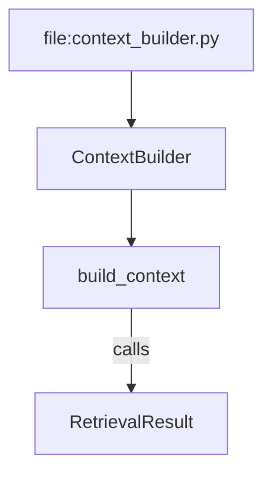

# Deep dive: Code graph enrichment

**First-pass:** [../code-graph.md](../code-graph.md)  
**Plan slot:** [INTEGRATION_PLAN.md](INTEGRATION_PLAN.md) PR 4  
**Seam:** `harness/knowledge_graph.py`, `harness/models.py` (`RelationshipType`), `harness/retriever.py` neighbor expand

## 1. What we confirmed

Peers (Code-Graph-RAG → Memgraph/Neo4j + NL→Cypher + MCP; GraphCodeAgent dual graphs; RANGER Cypher+MCTS) all share one lesson: **vector RAG fails multi-hop “who calls / what exposes / is this dead?”** and a typed graph fixes it.

Code-Harness **already has** the right skeleton:

- `KnowledgeGraph` NetworkX `DiGraph`, persist `graph_{repo}.json`
- Node id `{type}:{file_path}:{name}`
- Edges: `contains`, `inherits`, `calls`, `references` (+ repo-graph `shared_import` / `shared_entity` / `depends_on`)
- Retrieval: expand neighbors (`expand_neighbors=3`, effectively bounded BFS)

We do **not** need Memgraph to get 80% of the accuracy win. We need **richer edges**, **gloss nodes**, and **smarter expansion**.

## 2. Gaps vs Code-Graph-RAG

| Capability | Them | Us today |
|------------|------|----------|
| EXPOSES / HTTP+CLI endpoints | first-class | missing (`RelationshipType` has no `exposes`) |
| test → code | MCP / traces | missing |
| gloss / note nodes | MCP tools | missing (docs are `DOCUMENTATION` chunks only) |
| Dynamic call overlay | `cgr trace` | missing |
| NL→Cypher | LLM | we should **not** add yet (hallucinated Cypher) |
| Dead-code reachability | call/reference walks | possible with current `calls` if those edges are complete |
| Multi-hop search | MCTS / beam | fixed depth / count |
| Diagrams | (wiki peers) | no Mermaid export |

`calls` construction uses import regex more than true call-graph resolution (see `.docs/knowledge-graph.md`). That is the real quality bug — new edge *types* on top of sparse `calls` will disappoint.

## 3. PR 4 design (NetworkX stays)

### 3.1 New relationship types

Add to `RelationshipType` (keep existing values stable):

```python
EXPOSES = "exposes"       # file/func → endpoint name (route, CLI, MCP tool)
TESTED_BY = "tested_by"   # test entity → code entity
GLOSS = "gloss"           # note node → entity
# DATA_FLOWS = "data_flows"  # optional; only if extract is cheap
```

Extractors (cheap, no LLM):

- **exposes:** FastAPI/Flask/Express decorators, `argparse`/`click` commands, `main.py` subparsers (`index`, `query`, …).
- **tested_by:** filename/path heuristic (`test_*.py`, `*_test.go`) + imported names intersection.
- **gloss:** files under `.code-harness/gloss/**/*.md` or `knowledge/gloss/*.md` with frontmatter `entity: class:harness/chunker.py:CodeChunker`.

### 3.2 Gloss nodes

A gloss is a `DOCUMENTATION` entity with `metadata["kind"] = "gloss"`. Indexed as a **high-priority** chunk (boost in RRF or prepend like `ARCHITECTURE.md`). This is the Obsidian-note idea from first pass without requiring Obsidian.

### 3.3 Beam expansion (replace naive BFS)

Current: take top hits, add up to `expand_neighbors` neighbors.

Proposed: for each seed, generate candidate edges, score:

```
score = edge_prior[type] * seed_retrieval_score * recency_boost
```

`edge_prior`: `exposes`/`calls`/`tested_by` > `contains` > `references`. Keep a beam of width `W` (default 6) and depth `D` (default 2). Cap total added chunks.

This is **not** RANGER MCTS. It is score-ordered BFS. Enough for PR 4.

### 3.4 Mermaid export

`python main.py info <repo> --mermaid [--focus entity_id]` dumps `graph TD` for a subgraph. Wiki generate (later) embeds that. No new dependency.

## 4. Explicitly deferred

- Neo4j/Memgraph adapter.
- NL→Cypher (allowlisted path templates later: `callers_of`, `callees_of`, `exposes`, `tests_for`).
- eBPF / pytest dynamic traces (`cgr trace`).
- GraphCodeBERT embeddings (eval first; embedding swap is orthogonal).

## 5. File-level sketch (future)

| File | Change |
|------|--------|
| `harness/models.py` | new `RelationshipType` values |
| `harness/knowledge_graph.py` | extractors + beam expand + mermaid |
| `harness/utils.py` | endpoint/test heuristics |
| `harness/retriever.py` | call `expand_beam` instead of flat neighbors |
| `.docs/knowledge-graph.md` | schema update (docs in the *code* PR, not this one) |
| `main.py` | `info --mermaid` |

## 6. Acceptance

- Fixture questions: “who calls `ContextBuilder.build_context`?”, “what CLI commands are exposed?” — citation-path hit rate up vs PR 1 baseline.
- Existing `graph_*.json` still loads (new edge types optional).
- Visualizer does not break if it ignores unknown `relationship` values (verify).
- Index time +<15% on this repo.

## 7. Risks

- Name-only linking (already a KG caveat) creates false `tested_by` / `calls`. Prefer file-local + qualified names; drop low-confidence edges (`metadata.confidence`).
- Beam can explode tokens — packer (PR 2) must already be in. **That is why KG is PR 4, not PR 1.**
- Gloss files can drift; treat as memory-like (supersede or date them). OKF types can represent gloss later.

## 8. Interaction with the loop

PR 3 grade step can request `deepen=graph` when the query matches `who calls|callers|callees|exposes|where is this used|dead code`. Easy lexical queries skip the graph (BM25-only). This is Adaptive RAG without a second model.

## 9. Recommended PR slice

PR 4 as specified in [INTEGRATION_PLAN.md](INTEGRATION_PLAN.md): types + cheap extractors + beam + mermaid. No graph DB.

## 10. Exposes extractor (this repo)

`main.py` argparse/typer-style commands should become:

```
exposes: file:main.py → "index"
exposes: file:main.py → "query"
exposes: file:main.py → "interactive"
exposes: file:main.py → "info"
exposes: file:main.py → "watch"
```

Heuristic: `add_parser("name")`, `@app.command()`, `click.command`, FastAPI `@app.get("/path")`. Confidence 0.8 for decorator hits, 0.5 for argparse string literals.

## 11. Tested-by extractor

```
test file imports ContextBuilder → tested_by(test_func, class:context_builder.py:ContextBuilder)
```

If no test tree exists (this repo today), extractor is a no-op. Still ship it; eval fixture can add a tiny `tests/test_chunker.py` later without blocking PR 4.

## 12. Beam walk example

Seed: `class:harness/context_builder.py:ContextBuilder` (dense hit).

Candidates:

1. `contains` → `build_context` (prior 0.4)
2. `calls` → `RetrievalResult` (prior 0.8)
3. `exposes` — none
4. `gloss` — if a note exists, prior 0.9

Keep top `W=6`. Depth 2 from `build_context` can pick `_assemble_context`. Stop when added chunks ≥ `expand_neighbors * 2` (default 6).

## 13. Mermaid sketch



Generated from edges only. If the visualizer assumes only `contains|inherits|calls|references`, it must ignore `exposes`/`tested_by`/`gloss` or we add a filter flag.

## 14. Failure modes

| Symptom | Mitigation |
|---------|------------|
| False `calls` via common names (`get`, `main`) | Require same-repo + uniqueness or qualified name |
| Beam adds huge files | Packer + skip `FILE` nodes unless seed is a file query |
| JSON schema break | New types additive; readers use `.get("relationship")` |

## 15. Implementation checklist

- [ ] Additive `RelationshipType` values only
- [ ] Exposes extractor covers `main.py` commands
- [ ] Beam width/depth in config
- [ ] `info --mermaid` dry-run on this repo
- [ ] Visualizer ignores unknown relationships
- [ ] No Neo4j/Memgraph extra
- [ ] Loop can request `deepen=graph`

## 16. Cross-links

- Deepen action in loop: [prompt-loop-graph-engineering.md](prompt-loop-graph-engineering.md)
- Mermaid consumed by wiki: [google-code-wiki.md](google-code-wiki.md)
- Gloss files may later be OKF `Gloss` types: [okf.md](okf.md)
