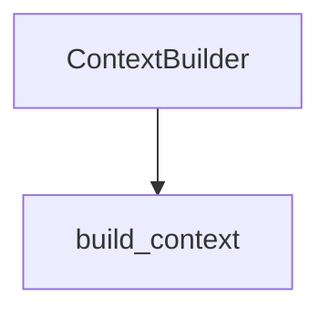

# Deep dive: Google Code Wiki (living wiki + grounded cites)

**First-pass:** [../google-code-wiki.md](../google-code-wiki.md)  
**Plan slot:** cite/`path:symbol` with PRs 2–4; `wiki generate` later #6  
**Seam:** future generator over `KnowledgeGraph` + packer; not a Google API client

## 1. What we confirmed

Google Code Wiki (public preview ~2025-11-13, [codewiki.google](https://codewiki.google/), [announcement](https://developers.googleblog.com/en/introducing-code-wiki-accelerating-your-code-understanding/)):

1. Ingest a public GitHub repo.
2. Continuously regenerate a structured wiki as the code changes.
3. Architecture / class / dependency / sequence diagrams stay current.
4. Every section and chat answer **hyperlinks to exact source files/defs**.
5. Chat is grounded on the wiki, not a generic model.

Private-repo Gemini CLI extension was waitlisted. We **cannot** depend on the hosted product. We steal the **artifact shape**.

OKF’s blog pitch is the same pattern formalized as a portable bundle ([okf.md](okf.md)). Wiki pages should be OKF `WikiPage` / `Symbol` concepts when we emit them.

## 2. Complementary to RAG (not a replacement)

| RAG (`query`) | Wiki |
|---------------|------|
| Answers one question from live chunks | Persistent, navigable narrative |
| Drifts only as the index drifts | Drifts if generator is not incremental |
| High token per question if we stuff bodies | Cheap prefix: summaries first, expand via CCR |

Best combined system (Headroom + Code Wiki):

```
brief wiki pages (packed) → retrieve_chunk / source links on demand
```

That is why packer is PR 2 and wiki is later: without retrieve-back, a generated wiki becomes another stale `ARCHITECTURE.md`.

## 3. What to implement eventually

### 3.1 Incremental `wiki generate`

```
python main.py wiki generate <repo> [--module harness/context_builder.py]
```

Inputs: `graph_{repo}.json`, file docstrings, existing `.docs/architecture.md` (do not overwrite blindly — write `knowledge/wiki/`).

Outputs per module: purpose, public symbols, mermaid from KG (`contains`/`calls`/`inherits`), links `path:symbol`.

`watch` already reindexes; hook **module-level** regen when that file’s entity set changes (content hash of subgraph).

### 3.2 Grounded citations (cheap, do now-ish)

Even before wiki, LLM answers should cite `` `harness/context_builder.py:ContextBuilder.build_context` ``. The packer already prints `file_path` + `entity_name`. Add one system-prompt line in the loop PR: “Cite path:symbol from chunk headers.” Eval citation-path already measures this.

### 3.3 Chat-over-wiki

Once pages exist, retrieval can boost `entity_type=documentation` / `metadata.kind=wiki` in RRF. Loop deepen = fetch linked source chunks (CCR).

## 4. Minimum viable wiki (do not boil the ocean)

v1: **one page per top-level package** + a regenerated `knowledge/wiki/architecture.md` that *links* to human `.docs/architecture.md` rather than replacing it.

Not v1: sequence diagrams from dynamic traces, pretty hosted site, Gemini.

## 5. File-level sketch (future #6)

| File | Change |
|------|--------|
| `harness/wiki.py` (new) | subgraph → markdown + mermaid |
| `main.py` | `wiki generate` |
| `harness/knowledge_graph.py` | mermaid helper (shared with PR 4) |
| `harness/okf.py` | emit `WikiPage` frontmatter |
| `watch` path in `main.py` | dirty-module regen |

## 6. Acceptance

- Regenerating twice without code changes is a no-op (hash stable).
- Every wiki heading has at least one `path:symbol` link that exists in the KG.
- Eval “explain architecture” uses wiki pages and still cites source files.
- No Google API keys.

## 7. Risks

- Generation cost: full-repo LLM wiki is expensive. Prefer **template + KG** first (no LLM), LLM polish optional per module.
- Overwriting human docs: write only under `knowledge/wiki/`.
- Hallucinated diagrams: mermaid must be **exported from edges**, not asked of the model.

## 8. Recommended PR slice

- **Now (with PR 3):** citation instruction + eval.
- **PR 4:** mermaid export (wiki precursor).
- **Later #6:** generator + OKF pages + watch hook.

Do not start a docs site, search UI, or Google integration.

## 9. Template page (no LLM)

```markdown
---
type: WikiPage
title: harness.context_builder
generated: true
verified: false
okf_version: "0.2"
---

# harness.context_builder

Source: [`harness/context_builder.py`](../../harness/context_builder.py)

## Symbols
- [`ContextBuilder.build_context`](../../harness/context_builder.py) — assemble packed context
- [`ContextBuilder._deduplicate`](../../harness/context_builder.py)

## Graph

```

Fill symbols from KG nodes with `file_path == that module`. Docstring first line if present; else leave the em dash.

## 10. Incremental dirty set

On `watch` file change:

1. Re-parse file → entity ids
2. If entity id set or source hash changed → mark module dirty
3. Regen that module page + regenerate architecture index links only

Do not walk the whole repo.

## 11. Citation instruction (loop PR)

System addendum (stable prefix):

> Cite evidence as `path:symbol` using chunk headers. If a body was omitted, call retrieve or say you only saw the signature.

Eval `must_cite_paths` scores this without needing wiki pages.

## 12. Failure modes

| Symptom | Mitigation |
|---------|------------|
| LLM-invented mermaid | Export edges only |
| Wiki vs `.docs/architecture.md` drift | Wiki links out; never overwrite `.docs/` |
| Regen on every keystroke | Hash gate |
| Hosted Code Wiki feature envy | Stay CLI files |

## 13. Implementation checklist

- [ ] Citation instruction in loop PR (no generator yet)
- [ ] Mermaid helper lands with KG PR
- [ ] Write only under `knowledge/wiki/`
- [ ] Hash-stable regen
- [ ] Template path first; LLM polish optional
- [ ] OKF `WikiPage` frontmatter
- [ ] `watch` dirty-module only
- [ ] No Google APIs

## 14. Cross-links

- Packer retrieve-back: [headroom.md](headroom.md)
- OKF emit: [okf.md](okf.md)
- Mermaid: [code-graph.md](code-graph.md)
- Plan slot #6: [INTEGRATION_PLAN.md](INTEGRATION_PLAN.md)
